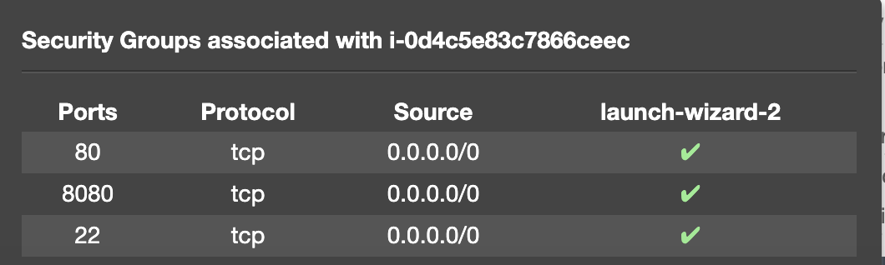

### Setup Kubernetes (K8s) Cluster on AWS

1.  Create Ubuntu EC2 instance with default group as below, this is not allowed but for demo this is fine.
    
    
    
1.  Install AWSCLI, by login as root: `sudo su - ` 
    ```shell
    curl https://s3.amazonaws.com/aws-cli/awscli-bundle.zip -o awscli-bundle.zip
    apt install unzip python
    unzip awscli-bundle.zip
    # sudo apt-get install unzip - if you dont have unzip in your system
    ./awscli-bundle/install -i /usr/local/aws -b /usr/local/bin/aws
    ```
    finally verify using
    ```shell
    aws --version
    ```
1.  Install `kubectl` on this ubuntu instance (still in root)
    ```shell
    curl -LO https://storage.googleapis.com/kubernetes-release/release/$(curl -s https://storage.googleapis.com/kubernetes-release/release/stable.txt)/bin/linux/amd64/kubectl
    chmod +x ./kubectl
    sudo mv ./kubectl /usr/local/bin/kubectl
    ```
    verify it using
    ```shell
    kubectl version
    ```
    
1.  Install kops on ubuntu instance. In short this will help to setup k8s cluster.[Read more](https://cloudacademy.com/blog/kubernetes-operations-with-kops/)
    ```shell
    curl -LO https://github.com/kubernetes/kops/releases/download/$(curl -s https://api.github.com/repos/kubernetes/kops/releases/latest | grep tag_name | cut -d '"' -f 4)/kops-linux-amd64
    chmod +x kops-linux-amd64
    sudo mv kops-linux-amd64 /usr/local/bin/kops
    ```
1.  Create an IAM user/role with Route53, EC2, IAM and S3 full access.[Read more](https://github.com/kubernetes/kops/blob/master/docs/aws.md) regarding role and policies.
    . Now attach this new role to our EC2 Ubuntu instance using Attach/Replace IAM rule. 
    
1.  If you create IAM user with programmatic access then provide Access keys. Otherwise region information is enough.
    ```shell
    AWS Access Key ID [None]: 
    AWS Secret Access Key [None]: 
    Default region name [None]: us-east-1
    Default output format [None]: 
    ```
1.  Create a private Bucket in S3 e.g. `k8s.demo.net` and check is EC2 ubuntu instance that you can read the bucket by `aws s3 ls`
1.  Create a Route53 private hosted zone (you can create Public hosted zone if you have a domain).
    ```shell
    Routeh53 --> hosted zones --> created hosted zone  
    Domain Name: demo.net
    Type: Private hosted zone for Amzon VPC usinig US_east VPC from the dropdownlist
    ```
1.  Expose environment variable or store it in profile.
    ```shell
    oot@ip-xxx:~# aws s3 ls
    2019-08-28 20:57:36 k8s.demo.net
    root@ip-xxx:~# export KOPS_STATE_STORE=s3://k8s.demo.net
    root@ip-xxx:~#
    ```
1.  Create sshkeys before creating cluster
    ```shell
    ssh-keygen
    ```
1.  Create kubernetes cluster definitions/configuration on S3 bucket
    ```shell
    kops create cluster --cloud=aws --zones=us-east-1b --name=k8s.demo.net --dns-zone=demo.net --dns private 
    ```
    This will simply create a configuration file in s3 bucket you created earlier.
    
    
    After running above command, please make sure to pay attention to some useful suggested commands at the bottom of the output.
    ```shell
    Suggestions:
    * validate cluster: kops validate cluster
    * list nodes: kubectl get nodes --show-labels
    * ssh to the master: ssh -i ~/.ssh/id_rsa admin@api.k8s.demo.net
    * the admin user is specific to Debian. If not using Debian please use the appropriate user based on your OS.
    * read about installing addons at: https://github.com/kubernetes/kops/blob/master/docs/addons.md.
    ```  
1.  Since, this is a demo, so master instance machine configuration of K8S can be t2.micro. To change master instance configuration run 
    ```shell
    kops edit ig --name=k8s.demo.net master-us-east-1b
    ```
    change the `machineType` to `machineType: t2.micro` 
    
1.  Now create cluster in AWS.
    ```shell
    kops update cluster --name k8s.demo.net --yes
    ```
    That takes a few seconds to run, but then your cluster will likely take a few minutes to actually be ready. `kops update cluster` will be the tool you’ll use whenever you change the configuration of your cluster; it applies the changes you have made to the configuration to your cluster - reconfiguring AWS or kubernetes as needed.

1.  Validate cluster using
    ```shell
    kops validate cluster
    ```
    as soon as it finished, it will be like 
    ```shell
    root@ip-xxxx:~# kops validate cluster
    Using cluster from kubectl context: k8s.demo.net

    Validating cluster k8s.demo.net

    INSTANCE GROUPS
    NAME			    ROLE	MACHINETYPE	MIN	MAX	SUBNETS
    master-us-east-1b	Master	t2.micro	1	1	us-east-1b
    nodes			    Node	t2.medium	2	2	us-east-1b

    NODE STATUS
    NAME				ROLE	READY
    ip-172-20-51-215.ec2.internal	node	True
    ip-172-20-59-108.ec2.internal	node	True
    ip-172-20-60-45.ec2.internal	master	True

    Your cluster k8s.demo.net is ready
    root@ip-xxxx:~# 

    ```
    on EC2 services it will display 2 nodes of t2.medium while master is of t2.micro.
    
1.  Now connect to the master using
    ```shell
    ssh -i ~/.ssh/id_rsa admin@api.k8s.demo.net
    ```
1.  Go to root by `sudo su - ` and run `kubectl version` 
    This will give you older version of Kubectl, to upgrade the latest version of kubectl in master.run
    ```shell
    curl -LO https://storage.googleapis.com/kubernetes-release/release/$(curl -s https://storage.googleapis.com/kubernetes-release/release/stable.txt)/bin/linux/amd64/kubectl
    chmod +x ./kubectl
    sudo mv ./kubectl /usr/local/bin/kubectl
    ```
1.  To get the cluster status
    ```shell
    kops validate cluster
    ```
1.  To list the nodes
    ```shell
    kubectl get nodes
    ```
1.  From now on, login to master and deploy service.yml and deployment.yml
    or run below to test
    ```shell
    kubectl run --image=nginx nginx-app --port=80 --replicas=2 --generator=run-pod/v1
    
    ```
